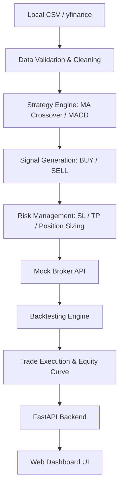

# Algo Trading System

A modular, lightweight Algorithmic Trading Backtester and Web Dashboard built in Python and FastAPI. It uses historical market data, applies technical strategies, manages risk (Stop Loss, Take Profit, Position Sizing), routes trades through a simulated (Mock) Broker, and evaluates performance using professional metrics.

---

## 🌟 Key Features

- **Interactive Web Dashboard**: A beautiful, dark glassmorphic single-page application built with HTML/CSS/JS and served by FastAPI.
- **JWT Authentication**: Fully functional Login and Registration system to secure your trading dashboard.
- **WebSocket Live Ticker**: Real-time mock data streaming to the dashboard for a live market feel.
- **Strategy Comparison**: Compare multiple strategies (Moving Average Crossover vs. MACD) side-by-side with interactive charts.
- **CSV Data Export**: Easily download your backtest chart data into a local CSV for external analysis.
- **Local Data Prioritization**: Automatically uses your local `all_market_data.csv` to ensure fast, offline-capable backtesting without constantly hitting Yahoo Finance.
- **Active Risk Management**: Support for Stop Loss, Take Profit, and risk-adjusted position sizing (e.g., risking only 1% of total equity per trade).
- **Comprehensive Performance Metrics**: Net PnL, Benchmark returns comparison, win rate, profit factor, maximum drawdown (peak-to-trough), and annualized Sharpe ratio.

---

## 🏗 Architecture Flow



---

## 📂 Directory Structure

```text
Algo_Trading_System_final/
│
├── mini_algo_trading/
│   ├── api/                   # FastAPI Server, Auth, and Static Files (HTML/JS/CSS)
│   ├── backtest/              # Main backtest runner / event loop
│   ├── broker/                # Stateful mock broker (cash, trades, stops)
│   ├── config/                # Configurable trading parameters (config.yaml)
│   ├── data/                  # Data downloading and cleaning logic
│   ├── metrics/               # Performance analytics (PnL, Drawdown, Sharpe)
│   ├── models/                # Dataclasses (Trade, Signal, Position)
│   ├── risk/                  # Stop Loss / Take Profit & sizing calculator
│   ├── strategies/            # MA Crossover & MACD implementations
│   ├── utils/                 # Logging and constants
│   └── main.py                # CLI entry point
│
├── data/                      # Local datasets (all_market_data.csv)
├── run.sh                     # Bash script to run the server
├── setup.sh                   # Bash script to setup virtual env
└── README.md                  # This file
```

---

## 🚀 Installation & Setup

1. **Clone the repository:**
   ```bash
   git clone https://github.com/riddhi113/Algo_Trading_System_final.git
   cd Algo_Trading_System_final
   ```

2. **Run the setup script:**
   This will create a Python virtual environment and install all necessary dependencies.
   ```bash
   bash setup.sh
   ```

---

## 💻 Running the Application

To run the backtest and start the dashboard server, simply execute:
```bash
./run.sh
```

**What this does:**
1. Starts the FastAPI server on port 8080.
2. Serves the interactive Web Dashboard.
3. Listens for backtest requests, auth events, and opens WebSocket connections.

**View the Dashboard:**
Once the server is running, open your web browser and go to:
[http://127.0.0.1:8080](http://127.0.0.1:8080)

To stop the server, press `Ctrl+C` in your terminal.

---

## ⚙️ How to Add a New Strategy

1. Create a new file in `mini_algo_trading/strategies/` (e.g. `rsi.py`).
2. Subclass `BaseStrategy` from `mini_algo_trading.strategies.base_strategy`.
3. Implement `generate_signals(self, df: pd.DataFrame) -> pd.DataFrame`.
   - Calculate your indicators (e.g. RSI).
   - Set a `"Signal"` column on the returned DataFrame containing `"BUY"`, `"SELL"`, or `"HOLD"`.
4. Update `api/server.py` to expose your strategy to the web dashboard.
