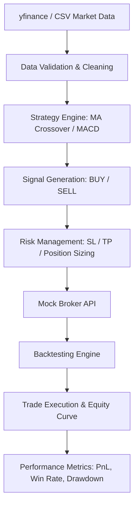

# Mini Algo Trading System

A modular, lightweight Algorithmic Trading Backtester in Python. It downloads historical market data from `yfinance`, applies technical strategies, validates the data, manages risk (Stop Loss, Take Profit, Position Sizing), routes trades through a simulated (Mock) Broker, and evaluates performance using professional metrics.

---

## Architecture Flow



---

## Directory Structure

```
mini_algo_trading/
│
├── data/
│   ├── market_data.csv        # Downloaded historical OHLCV CSV
│   └── loader.py              # Fetches and cleans market data
│
├── strategies/
│   ├── base_strategy.py       # Abstract Strategy interface class
│   ├── moving_average.py      # Moving Average crossover strategy
│   └── macd.py                # MACD Line crossover strategy
│
├── broker/
│   └── mock_broker.py         # Stateful mock broker (cash, trades, stops)
│
├── backtest/
│   └── engine.py              # Main backtest runner / event loop
│
├── risk/
│   └── risk_manager.py        # Stop Loss / Take Profit & sizing calculator
│
├── metrics/
│   └── performance.py         # Performance analytics (PnL, Drawdown, Sharpe)
│
├── models/
│   ├── signal.py              # Dataclass representing strategy signals
│   ├── trade.py               # Models executed trades
│   └── position.py            # Tracks open market holdings
│
├── config/
│   └── config.yaml            # Configurable trading parameters
│
├── utils/
│   ├── logger.py              # Formatted timing & console/file logging
│   └── constants.py           # Standard names for columns and default paths
│
├── tests/
│   ├── test_strategy.py       # Unit tests for strategies
│   ├── test_broker.py         # Unit tests for broker order execution
│   └── test_backtest.py       # Unit tests for engine simulations
│
├── main.py                    # Entry point to execute the pipeline
└── README.md                  # System overview and usage guidelines
```

---

## Features

- **yfinance Integration**: Automatically downloads data if local CSV is missing.
- **Data Integrity Validation**: Rejects non-positive prices, fixes logical price anomalies (e.g. `High < Open`), and converts columns case-insensitively.
- **Extensible Strategies**: Simple abstract base class interface makes adding new indicators/strategies easy.
- **Active Risk Management**: Support for Stop Loss, Take Profit, and risk-adjusted position sizing (e.g. risking only 1% of total equity per trade).
- **Comprehensive Performance Metrics**: Net PnL, Benchmark returns comparison, win rate, profit factor, maximum drawdown (peak-to-trough), and annualized Sharpe ratio.
- **Short Selling Support**: Can be toggled on/off in the configuration file.

---

## Installation & Setup

1. **Clone/Navigate** to your workspace root.
2. **Install dependencies**:
   ```bash
   pip install yfinance pandas pyyaml numpy
   ```

---

## Running the Application

### 1. Launch Interactive Web Dashboard
You can choose from two different interactive frontends:

#### Option A: FastAPI + HTML/JS/CSS (Recommended)
This launches a custom single-page web app styled with dark glassmorphic CSS, served by a FastAPI backend:
```bash
./run.sh --fastapi
```
Open your browser and go to `http://127.0.0.1:8080`.

#### Option B: Streamlit Web Dashboard
An alternative Python-based interactive dashboard:
```bash
./run.sh --dashboard
```
Open the provided URL (default `http://localhost:8501`) in your browser.

### 2. Execute Backtest via CLI
Run the standard terminal-based pipeline from the workspace root:
```bash
./run.sh
```

### 3. Download Fresh/New Data via CLI
To bypass local cache and download fresh data from `yfinance` to CSV:
```bash
./run.sh --download
```

### 4. Customize Config
Modify `mini_algo_trading/config/config.yaml` to change:
- **Ticker** (e.g., `AAPL`, `MSFT`, `SPY`, `BTC-USD`)
- **Backtest Dates** (`start_date`, `end_date`)
- **Capital & Risk limits** (`initial_capital`, `stop_loss_pct`, `take_profit_pct`)
- **Strategy and parameters** (`active_strategy`, fast/slow periods)

---

## Running Tests
Unit tests can be run using the standard Python `unittest` tool:
```bash
python3 -m unittest discover -s mini_algo_trading/tests -p "test_*.py"
```

---

## How to Add a New Strategy

1. Create a new file in `strategies/` (e.g. `rsi.py`).
2. Subclass `BaseStrategy` from `strategies.base_strategy`.
3. Implement `generate_signals(self, df: pd.DataFrame) -> pd.DataFrame`.
   - Calculate your indicators (e.g. RSI).
   - Set a `"Signal"` column on the returned DataFrame containing `"BUY"`, `"SELL"`, or `"HOLD"`.
4. Update `main.py` to support loading your strategy when configured in `config.yaml`.
